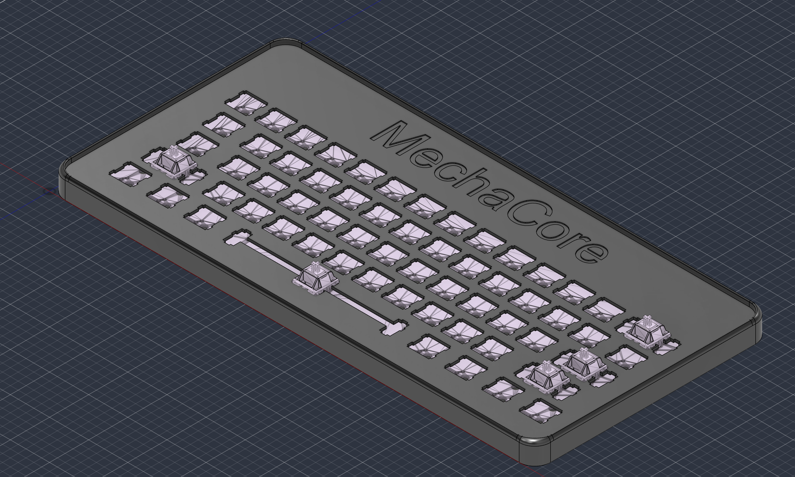
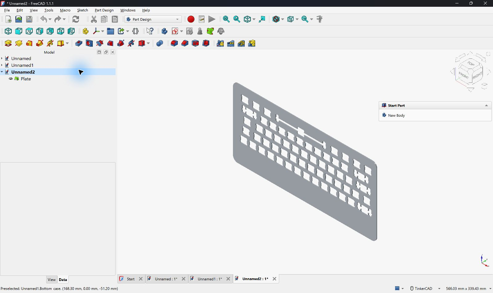
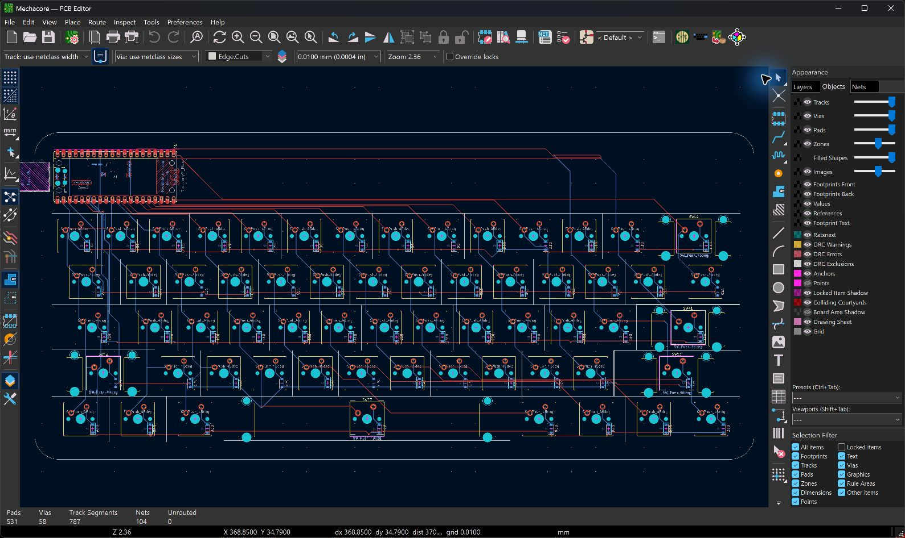
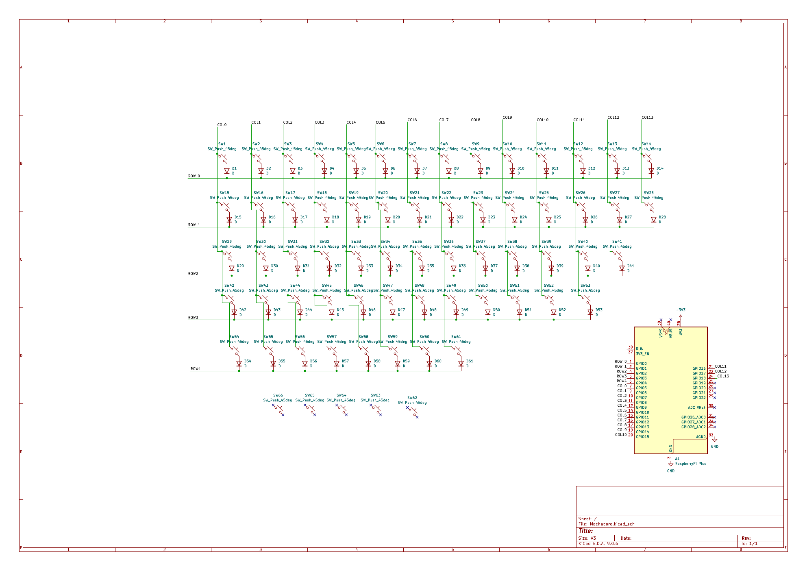
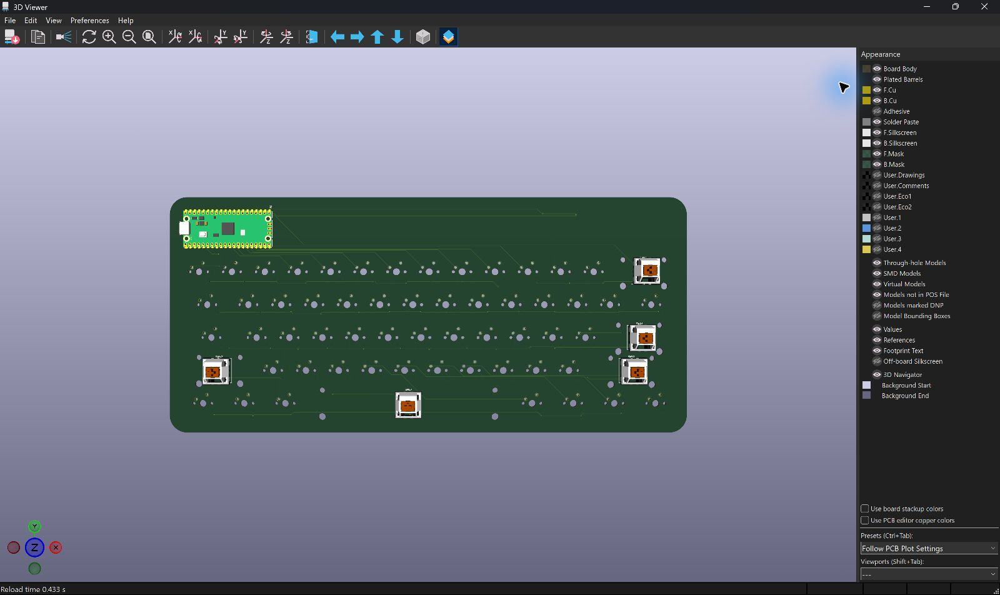
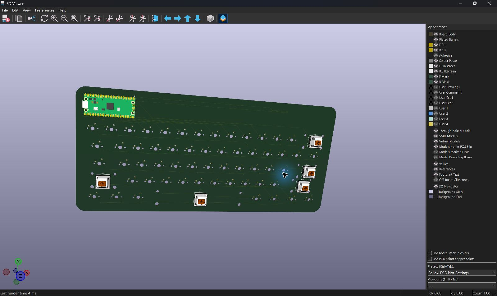
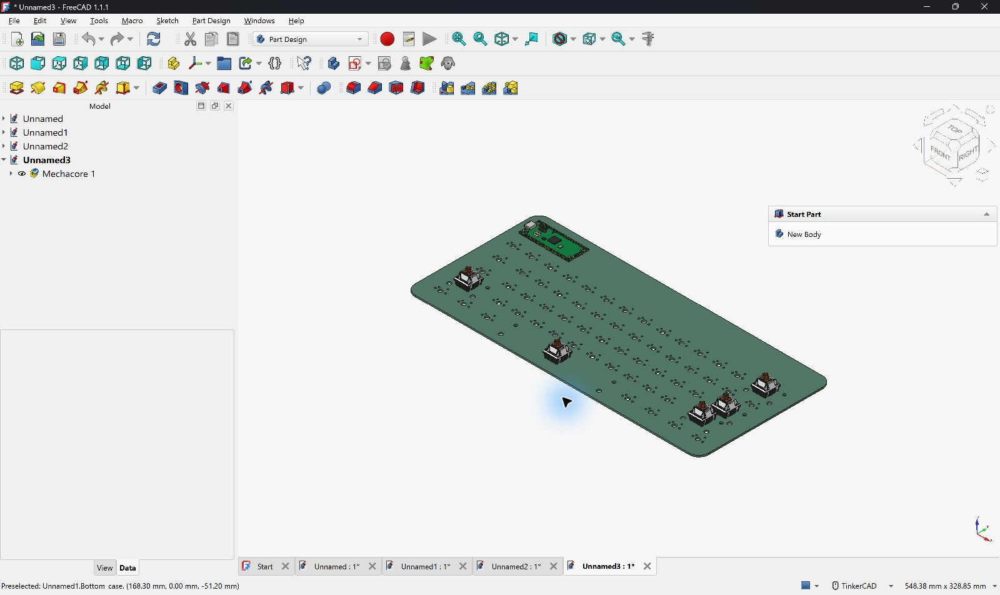
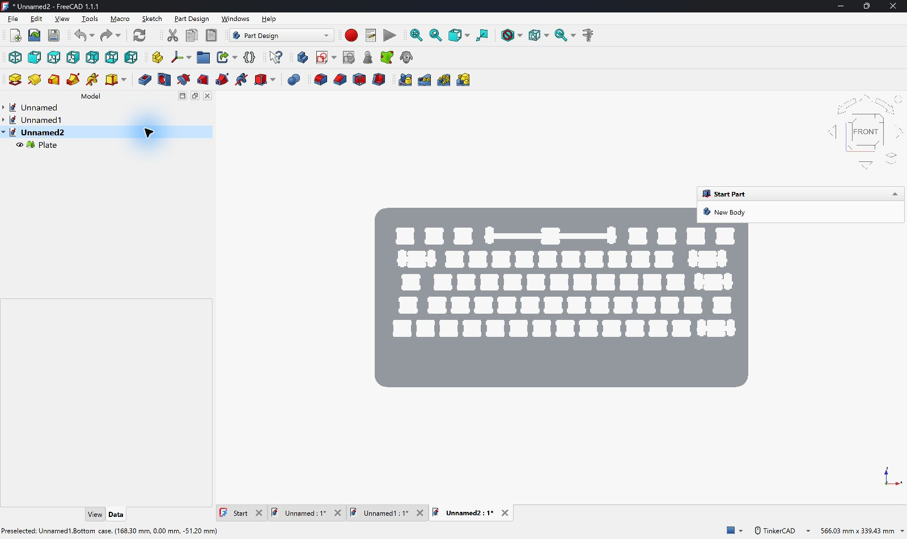
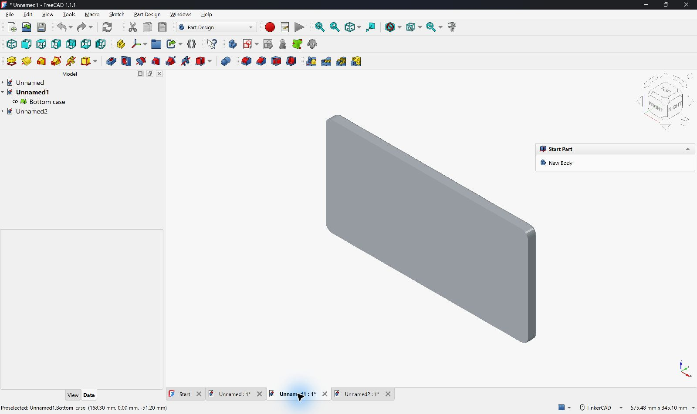

# MechaCore

MechaCore is my custom 60% (61 key) wired mechanical keyboard, its built around a **Raspberry Pi Pico 2** and a completely hand routed 2 layer PCB.

so basicaly i wanted to make a keyboard where i didnt just download somebody elses pcb and put switches in it.. i wanted to actualy understand the matrix, diodes, stabilizers, routing, plate tolerances and how the pcb fits inside a real printable case. i designed the layout, schematic, pcb and the full case from scratch using kicad + fusion 360 and ngl the case part took way more trys then i expected lol



## why i made this

i use a keyboard for school, coding and pretty much everything, but most custom boards i liked was either super expensive or still used a ready made pcb. making MechaCore was kinda my excuse to learn the full hardware pipeline instead of only assembling parts

main goals i set for myself :

- design a proper **60% ANSI PCB** in kicad with 61 switches
- wire the full matrix directly to a Raspberry Pi Pico 2
- hand route every row, column and diode connection on a real 2 layer board
- support screw-in stabilizers for backspace, enter, both shifts and the 6.25u spacebar
- make a rounded 3d printable bottom case + switch plate in fusion 360
- keep the files actualy manufacturable, not just make a nice looking render
- learn the full pipeline : keyboard layout -> schematic -> pcb -> 3d export -> case -> production files

the routing was easily the most painful bit because the board has 61 switches and basically no room for lazy paths 😭 after alot of moving tracks between front/back copper the pcb reached **0 unconnected items**, which felt kinda unreal after staring at ratsnest lines for so long

## project status

this repo has the full hardware design, cad, manufacturing exports and the Pico 2 firmware. the PCB and case geometry is done, the matrix pinout is locked and the firmware is ready to copy straight onto the controller

whats included :

- kicad project, schematic and fully routed pcb
- full 3d cad (`.f3d`, `.step` and printable `.stl` files)
- separate bottom case and switch plate exports
- production files (bom, positions, designators, ipc netlist and gerber zip)
- 60% ANSI keyboard layout json
- schematic and individual fabrication layer PDFs
- complete Pico 2 firmware with the matching CircuitPython UF2

current hardware summary :

| | |
|---|---|
| Layout | 60% ANSI, 61 keys |
| Controller | Raspberry Pi Pico 2 |
| Connectivity | wired USB through the Pico |
| Matrix | 14 columns x 5 rows, directly connected to the Pico |
| Diodes | 61x Slkor 1N4148W switching diodes, one per key (SOD-123, COL2ROW) |
| Stabilizers | Durock Clear screw-in V2 (6.25u space + 2u / 2.25u / 2.75u) |
| Switches | Akko V3 Penguin Pro |
| Keycaps | Plum Blossom cherry profile shine-through PBT |
| Case | 3d printed bottom shell + separate switch plate |
| PCB | 2 layer FR4, 300mm x 135.8mm, 1.6mm, green soldermask |
| Firmware | dependency free CircuitPython 10.2.1 USB HID firmware, 2 layers |

the dark rounded case and the big **MechaCore** name on the plate is what kinda gave the whole board its look. the pink plum blossom keycaps should contrast with it nicely, atleast thats the plan once it becomes a real physical board

## images

### full 3d model


### switch plate


### pcb


### schematic / wiring
the complete 14x5 matrix, all 61 switches, 61 diodes, stabilizer symbols and the Pico connections are kept in the same kicad project..



### other screenshots
some more actual views from kicad and the exported cad files







## repo file checklist

important files in this repo :

- `PCB/Mechacore.kicad_pro`
- `PCB/Mechacore.kicad_sch`
- `PCB/Mechacore.kicad_pcb`
- `3D/Case/Mechacore.f3d`
- `3D/Case/Mechacore.step`
- `3D/Case/Plate.stl`
- `3D/Case/Bottom case.stl`
- `3D/PCB/Mechacore.step`
- `3D/PCB/Mechacore.stl`
- `layout/keyboard-layout.json`
- `production/bom.csv`
- `production/positions.csv`
- `production/designators.csv`
- `production/netlist.ipc`
- `production/Mechacore.zip`  (gerbers)
- `bom.csv`  (build cost / purchase list)
- `PDFs/Mechacore.pdf`  (schematic print)
- `firmware/code.py`  (MechaCore key scanner + keymap)
- `firmware/boot.py`  (USB name + HID setup)
- `firmware/adafruit-circuitpython-raspberry_pi_pico2-en_US-10.2.1.uf2`

## cad

designed in **fusion 360**.. the editable `.f3d` file is in `3D/Case/` and theres a `.step` export right beside it if you only need the geometry. the two print ready pieces are `Plate.stl` and `Bottom case.stl`

the exact pcb was also exported as both STEP and STL in `3D/PCB/`. i used that model inside the case design instead of guessing the board outline, especially for the rounded corners, Pico usb opening, solder clearance and stabilizer holes

## firmware

firmware is finaly in the repo under `firmware/`. its a small dependency free CircuitPython setup written just for MechaCore, so theres no KMK folder, package install or placeholder pin list to fix later. the GPIO map was copied directly from the finished kicad PCB and the bundled UF2 is the official stable [CircuitPython Pico 2 build](https://circuitpython.org/board/raspberry_pi_pico2/)

| | |
|---|---|
| Runtime | CircuitPython 10.2.1 for Raspberry Pi Pico 2 |
| Rows | GP0, GP1, GP2, GP3, GP4 |
| Columns | GP5 through GP18 |
| Matrix | 5 rows x 14 columns, 61 populated positions |
| Diodes | column anode to row cathode (`columns_to_anodes=True`) |
| Debounce | 3 stable scans at 2ms, around 6ms total |
| USB | standard keyboard + consumer control HID |
| Rollover | 6 normal keys plus all modifiers |

the base layer follows the actual keycap layout :

```text
`     1   2   3   4   5   6   7   8   9   0   -   =   Backspace
Tab   Q   W   E   R   T   Y   U   I   O   P   [   ]   \
Caps  A   S   D   F   G   H   J   K   L   ;   '       Enter
Shift Z   X   C   V   B   N   M   ,   .   /           Shift
Ctrl  Win Alt             Space             Alt Win Menu/Fn Ctrl
```

the Menu key still works like a normal Menu key when tapped. hold it for 180ms or press it together with another key and it becomes Fn

- `Fn + backtick` = Escape
- `Fn + 1` through `Fn + =` = F1 through F12
- `Fn + Backspace` = Delete
- `Fn + U / I / O / P` = Home / Up / End / Page Up
- `Fn + J / K / L / ;` = Left / Down / Right / Page Down
- `Fn + Q / W / E` = Previous track / Play-Pause / Next track
- `Fn + M`, `Fn + ,`, `Fn + .`, `Fn + /` = Mute / Volume Down / Volume Up / Play-Pause

### flashing it

1. hold the BOOTSEL button on the Pico 2 while plugging the keyboard into usb
2. open the new `RP2350` drive and copy `firmware/adafruit-circuitpython-raspberry_pi_pico2-en_US-10.2.1.uf2` onto it
3. after it restarts as `CIRCUITPY`, copy `firmware/boot.py` and `firmware/code.py` to the root of that drive
4. unplug and reconnect once so the USB setup from `boot.py` loads cleanly

thats it, no pin edits or extra libraries are needed. the keyboard shows up as **MechaCore** and the files stay editable from the `CIRCUITPY` drive if i ever wanna change the layout later

## bom (summary)

full purchase list is in `bom.csv`. these prices are the rough planned cost in indian rupees, nothing was ordered yet

| # | Name | Purpose | Qty | Cost (₹) | Distributor | Link |
|---|------|---------|-----|----------|-------------|------|
| 1 | PCB fabrication | 2 layer MechaCore boards | 5 boards | 5288 | Robu | [Buy](https://robu.in/product/online-pcb-manufacturing-service/) |
| 2 | 3D printed case | bottom shell + plate | 1 set | 300 | Hack Club | — |
| 3 | Plum Blossom Cherry Profile Shine-Through PBT Keycap Set | keycaps to actualy type on | 1 set | 2500 | Curiosity Caps | [Buy](https://curiositycaps.in/products/plum-blossom-cherry-profile-shine-through-dye-sublimation-pbt-keycap-set) |
| 4 | Durock Clear Screw-In Stabilizers V2 | keeps the large keys stable | 1 set | 1595 | StacksKB | [Buy](https://stackskb.com/store/durock-clear-screw-in-stabilizers-v2/?attribute_combination=7%2B1+Set&attribute_spacebar-size=6.25U) |
| 5 | Akko V3 Penguin Pro Switch (Pack of 45) | mechanical switches + spares | 2 packs | 2,398 | StacksKB | [Buy](https://stackskb.com/store/akko-v3-cream-black-pro-switch-pack-of-45/) |
| 6 | Raspberry Pi Pico 2 | microcontroller / the brains | 1 | 519 | Robu | [Buy](https://robu.in/product/raspberry-pi-pico-2/) |
| 7 | Slkor 1N4148W SOD-123 switching diodes | one diode per switch + some spares | 70 pcs | 100.10 | Robu | [Buy](https://robu.in/product/1n4148w-slkor-75v-1v-4ns-150ma-sod-123-switching-diodes-rohs/) |

**rough total bom cost : ₹12,700.10**

---

thanks for reading,, if you build one or spot something weird feel free to open a issue. this was my first full keyboard pcb + case made from scratch so its deffinately not perfect but i learnt a insane amount making it :)
